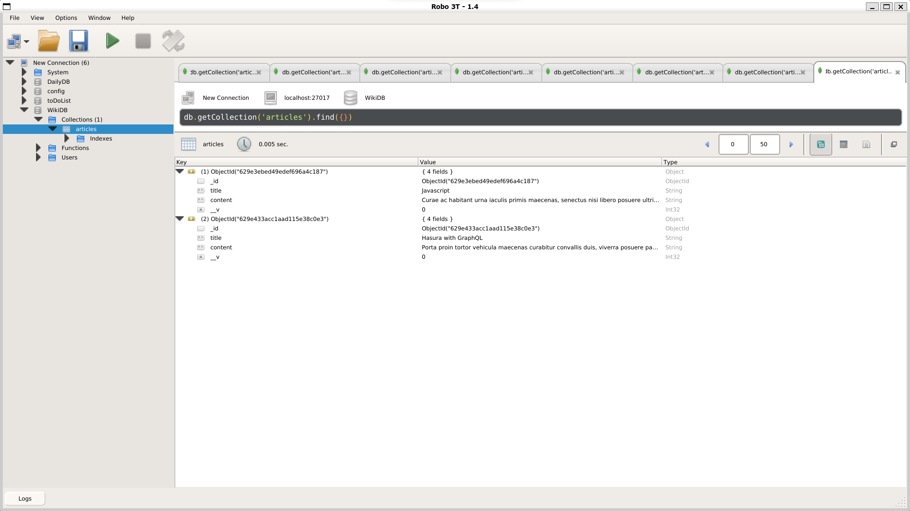

# Wiki Project

The Wiki project was built using different kind of technologies. 
The purpose of this project is to built our project with the REST routes. 
All the information and configuration, you can find it in thw index.js file located in the root folder.
Once you get into this file, you will see the different routes and what these routes do in this web application.

## Node packages.

* Nodemon.
* Express.
* EJS.
* Mongoose.
* Body-parser.
* Lodash. 

## Postman.

In order to open postman, you should type `postman` in the command line. If you don't have postman installed, you can see visit the next link below

* URL: https://morioh.com/p/e256fd7a2811

Or you can follow the next instructions:

* Download Postman: `wget https://dl.pstmn.io/download/latest/linux64 -O postman-linux-x64.tar.gz`.

* Extract the file: `sudo tar -xvzf postman-linux-x64.tar.gz -C /opt`.

* Create a symbolic link running: `sudo ln -s /opt/Postman/Postman /usr/bin/postman`.

* Open desktop Postman: `postman`.

## Robot3T.

Robot3T allows us to read our database intead of using the Linux Shell. For more inforamtion, you can check out the next URL.

* URL: https://linuxtutorialhub.com/how-to-install-robo3trobmongo-on-ubuntu-18-04-20-04/

## Notes.

* In order to get a URL that contains spaces, you can overwite them by adding: `%20`. 

All this information, you can check out by visiing the next link: 
* URL: https://www.w3schools.com/tags/ref_urlencode.asp

## Author.

* Jorge Ortiz.
* Software engineer.
* ortiz.mata.jorge@gmail.com
* San Luis Potosí, S.L.P., México. 

